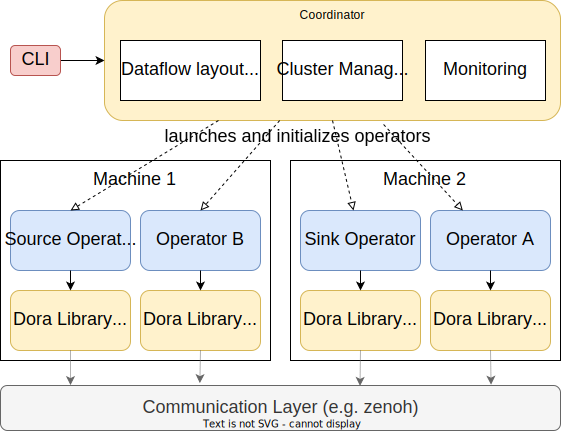

# Library-Based Design

## Light-weight Operators

Each operator is a separate, isolated process. This is for example useful for security-critical operators (isolation is important), resource-heavy operators (resources can be pinned to processes), or operators which need maximal control (e.g. for complex input rules). However, running each operator has a separate executable also has some drawbacks. For example, the isolation between operators comes with some overhead and not all features of dora are usable (e.g. no real-time support). For this reason, dora also supports so-called _light-weight_ operators, organized into operators groups.

Light-weight operators are cooperative, library-based components that are executed by a dora runtime process. Multiple formats are supported for light-weight operators, for example they can be implemented as a Python object, a WebAssembly module, or a traditional C-compatible shared library. The dora runtime links multiple light-weight operators (of the same operator group) together and executes them from a single, multi-threaded process. The full set of dora's features are available for light-weight operators, for example priority scheduling or native deadline support.
